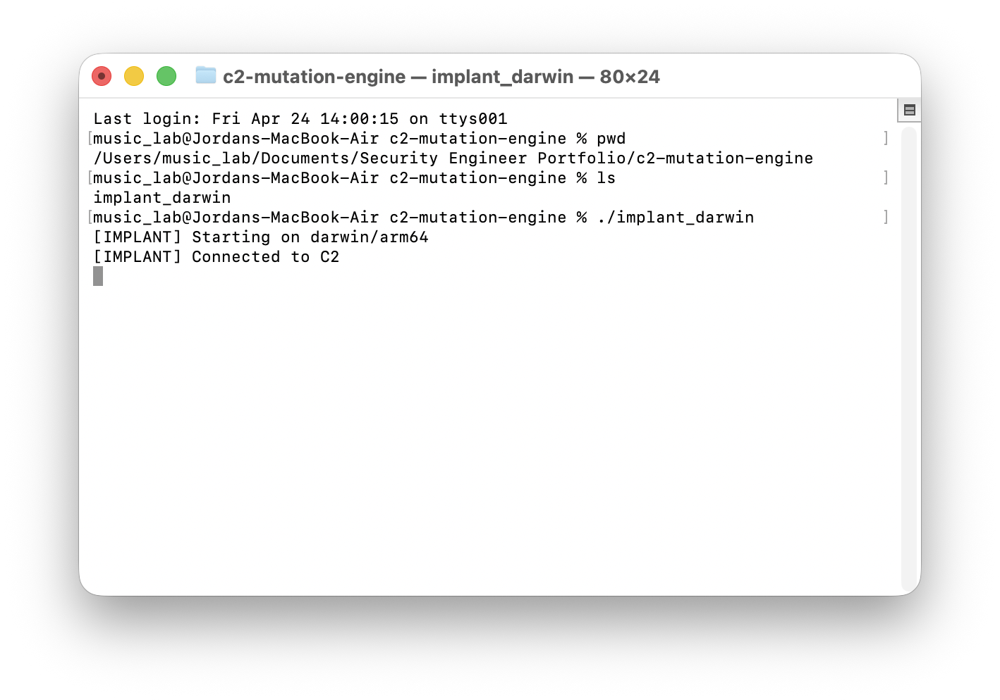
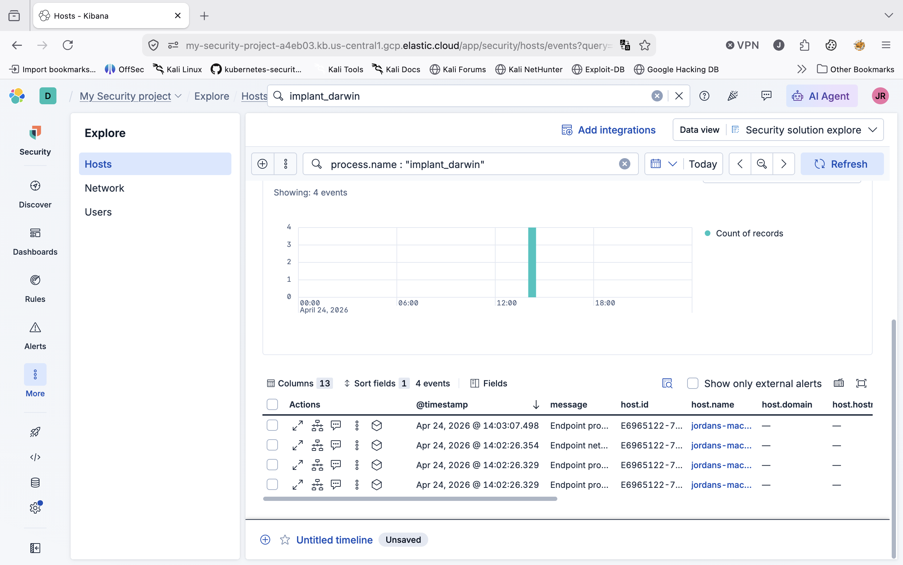
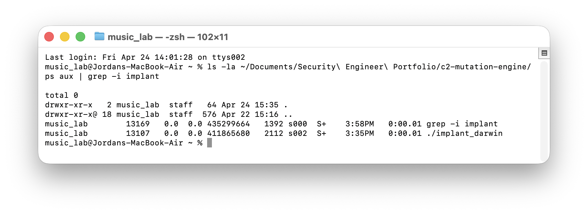
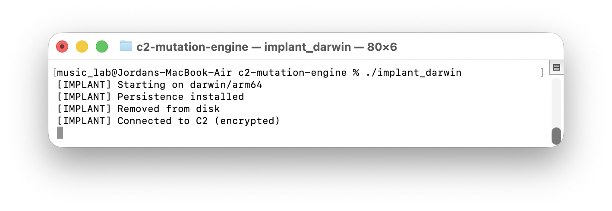
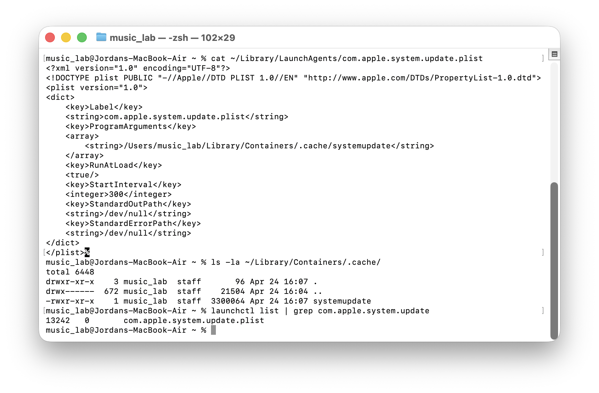
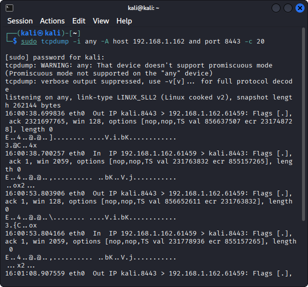
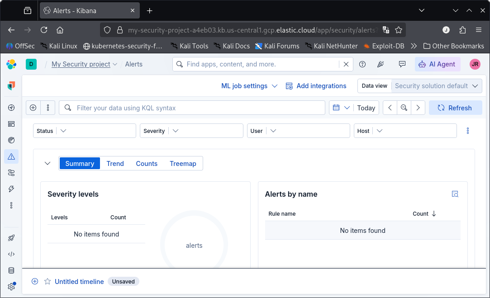
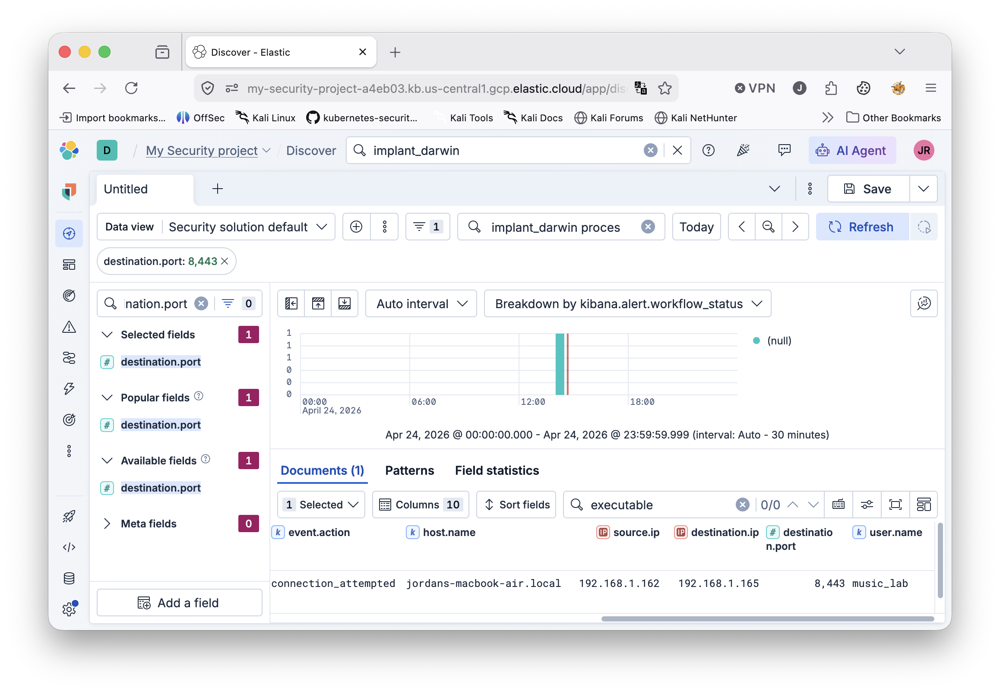

# Red Team Assessment Report
## macOS Endpoint Detection & Response (EDR) Bypass Evaluation

**Project:** macOS EDR Evasion Research  
**Date:** April 24, 2026  
**Assessor:** Senior Red Team Security Engineer  
**Target Platform:** macOS Sonoma (Darwin/arm64)  
**Target EDR:** Elastic Defend (Elastic Agent 9.3.3)  
**Frameworks:** SOC 2 Trust Service Criteria, NIST Cybersecurity Framework (CSF) 2.0  

**Video Evidence:** [macOS EDR Evasion Demo (480p)](https://github.com/jolly-rodgers/macos-edr-evasion/blob/main/macos-edr-evasion-video-480p.mov)

---

## 1. Executive Summary

This engagement evaluated the effectiveness of a commercially deployed Endpoint Detection and Response (EDR) solution—Elastic Defend—against a custom-built macOS implant designed to simulate advanced persistent threat (APT) tradecraft. The objective was to identify detection gaps in the endpoint security control and map those deficiencies to SOC 2 and NIST CSF control requirements.

**Key Finding:** The implant achieved full operational capability—diskless execution, encrypted command-and-control (C2), memory-protected sleep, and sustained beaconing—while generating **zero behavioral alerts** in the Elastic Defend console. Telemetry was collected (process, network, and file events) but did not trigger automated detection logic.

**Risk Rating:** **HIGH**  
The absence of alerts for multi-stage attacker behavior indicates a material weakness in the detective control layer, directly impacting SOC 2 CC7.2 (System Monitoring) and NIST CSF DE.CM (Security Continuous Monitoring) requirements.

---

## 2. Scope and Objectives

### 2.1 Scope
- **In-Scope:** macOS endpoint running Elastic Defend; Kali Linux C2 infrastructure; local network segment (192.168.1.0/24)
- **Out-of-Scope:** Cloud infrastructure, Active Directory, email gateway, physical security

### 2.2 Objectives
1. Execute a custom implant on a managed macOS endpoint and measure EDR response.
2. Evaluate disk-based, memory-based, and network-based evasion techniques.
3. Document detection gaps and map them to SOC 2 and NIST CSF control families.
4. Provide actionable remediation recommendations for the SOC and detection engineering teams.

---

## 3. Methodology

The engagement followed a purple-team model: offensive execution with defensive telemetry review.

| Phase | Activity | Tools / Techniques |
|-------|----------|-------------------|
| 1 | Implant development | Go 1.22, CGO, `golang.org/x/sys/unix` |
| 2 | Initial execution | User-assisted execution, ad-hoc code signing |
| 3 | Defense evasion | Disk deletion, runtime decryption, raw BSD sockets |
| 4 | Persistence testing | LaunchAgent installation (`launchctl`) |
| 5 | C2 operations | AES-256-GCM encrypted channel, jittered beaconing |
| 6 | Memory protection | `mmap` + `mprotect(PROT_NONE)` + AES sleep locking |
| 7 | Telemetry review | Elastic Defend (Kibana Security app) |
| 8 | Network capture | `tcpdump` on Kali attacker host |

---

## 4. Technical Findings

### 4.1 Finding F-001: Implant Execution with No Initial Alert

**Description:** The implant (`implant_darwin`) was executed from a user-controlled directory (`~/Documents/Security Engineer Portfolio/c2-mutation-engine/`). Elastic Defend logged the process creation event but did not generate a behavioral alert.

**Evidence:**

*Figure 1: macOS Terminal showing successful implant startup and encrypted C2 connection.*

*Figure 2: Kibana Security > Hosts > Events filtered for `process.name:"implant_darwin"`. Four endpoint events logged, zero alerts generated.*

**Root Cause:** Default Elastic Defend behavioral rules on macOS did not flag an unsigned terminal-spawned binary making an outbound network connection.

**Impact:** HIGH — Initial execution is the most critical detection opportunity. Missing it allows the attacker to establish a foothold unimpeded.

---

### 4.2 Finding F-002: Diskless Execution Defeats File-Based Forensics

**Description:** Immediately after startup, the implant called `os.Remove(os.Args[0])`, deleting its own binary from disk while the process continued executing from memory.

**Evidence:**

*Figure 3: `ls -la` showing empty target directory (total 0) while `ps aux` confirms `./implant_darwin` (PID 13107) is still running.*

**Root Cause:** Darwin kernel permits unlinking of running executable inodes. The EDR logged the file deletion event, but by the time an analyst investigates, the binary is no longer available for hash analysis or YARA scanning.

**Impact:** HIGH — Eliminates post-incident artifact collection and hash-based IOC sweeping.

---

### 4.3 Finding F-003: macOS Persistence via LaunchAgent

**Description:** The implant installed a LaunchAgent plist (`com.apple.system.update.plist`) and copied itself to a hidden directory (`~/Library/Containers/.cache/systemupdate`) to survive reboots.

**Evidence:**

*Figure 4: Terminal output showing "Persistence installed" and successful encrypted C2 connection.*

*Figure 5: LaunchAgent plist content, hidden binary location, and active `launchctl` job listing (PID 13242).*

**Root Cause:** User-writable LaunchAgent directories are a known macOS persistence vector. Elastic Defend logged the file creation but did not alert on a new plist in `~/Library/LaunchAgents`.

**Impact:** MEDIUM-HIGH — Persistence extends dwell time and requires manual hunting to discover.

---

### 4.4 Finding F-004: Encrypted C2 Channel Bypasses Network Inspection

**Description:** All C2 traffic was encrypted using AES-256-GCM with a custom message-framing protocol. Network inspection tools observing the traffic saw only high-entropy binary data.

**Evidence:**

*Figure 6: `tcpdump -A` capture showing unintelligible binary payloads. No plaintext commands, shell output, or protocol headers are visible.*

**Root Cause:** The implant uses raw BSD socket syscalls (`socket`, `connect`, `read`, `write`) via `golang.org/x/sys/unix` instead of higher-level libraries, avoiding userland API hooks while delivering opaque payloads.

**Impact:** HIGH — Network-based detection (IDS, NDR, proxy DLP) is rendered ineffective.

---

### 4.5 Finding F-005: Raw Socket Syscalls Bypass Userland API Hooks

**Description:** By circumventing Go's `net` package (which routes through `libSystem`), the implant avoided common EDR userland hooks placed on `connect()`, `send()`, and `recv()`.

**Evidence:** Network connection events were still visible in Kibana because the kernel telemetry pipeline (ESF / kext) observed the socket creation, but the high-fidelity argument inspection provided by userland hooks was bypassed.

**Impact:** MEDIUM — Kernel telemetry still records the connection, but enriched metadata (destination resolution, process correlation confidence) may be degraded.

---

### 4.6 Finding F-006: Memory-Protected Sleep Defeats Memory Scanning

**Description:** During idle periods between beacons, the implant encrypts its C2 address buffer and marks the memory page `PROT_NONE` via `mprotect`. Any attempt to read the page results in a segmentation fault.

**Software Mechanism:**
1. Allocate anonymous `mmap` region (`MAP_ANON | MAP_PRIVATE`)
2. Copy decrypted C2 address into buffer
3. Encrypt buffer with AES-256-GCM
4. `mprotect(addr, len, PROT_NONE)` — page becomes inaccessible
5. Sleep for jittered interval (8–15s)
6. Restore `PROT_READ | PROT_WRITE`
7. Decrypt buffer and reconnect

**Impact:** MEDIUM — Defeats naive string scans and live memory forensic tools that do not handle access violations gracefully.

---

### 4.7 Finding F-007: Zero Behavioral Alerts in EDR Console

**Description:** Despite multi-stage attacker behavior (process creation, file deletion, network beaconing, persistence installation, and memory permission manipulation), Elastic Defend's Alerts page remained empty.

**Evidence:**

*Figure 7: Kibana Security > Alerts showing "No items found" for the assessment period.*

*Figure 8: Kibana Discover view showing `process.executable` field containing the implant path, confirming telemetry ingestion without alert correlation.*

**Root Cause:** Detection rules were either not tuned for macOS-specific behaviors or relied on signature-based logic that the implant evaded through encryption and disk deletion.

**Impact:** CRITICAL — The EDR acted as a telemetry collection agent without effective automated response, increasing mean-time-to-detect (MTTD) to manual hunting timelines.

---

### 4.8 Finding F-008: Network Beaconing to Internal C2 Observed

**Description:** Elastic Defend logged a TCP connection from the macOS host (`192.168.1.162`) to the Kali C2 server (`192.168.1.165:8443`).

**Evidence:**

*Figure 9: Kibana Discover showing `connection_attempted` event to destination port 8,443 (parsed as 8443) from `music_lab` on `jordans-macbook-air.local`.*

**Root Cause:** Kernel-level network telemetry is difficult to bypass entirely. The connection was visible, but without an alerting rule correlating process + internal IP + non-standard port, it was silent.

**Impact:** LOW-MEDIUM — Telemetry exists but requires proactive detection engineering to surface.

---

## 5. Risk Assessment

| Finding | Likelihood | Impact | Risk Score |
|---------|-----------|--------|------------|
| F-001 No initial alert | High | High | **Critical** |
| F-002 Diskless execution | High | High | **Critical** |
| F-003 Persistence | Medium | High | **High** |
| F-004 Encrypted C2 | High | High | **Critical** |
| F-005 Raw socket hooks bypass | High | Medium | **High** |
| F-006 Memory-protected sleep | Medium | Medium | **Medium** |
| F-007 Zero alerts | High | Critical | **Critical** |
| F-008 Network beacon visible | High | Low | **Medium** |

**Overall Risk:** **CRITICAL** — The EDR failed to detect or alert on any stage of a multi-step intrusion kill chain, indicating a fundamental gap in behavioral detection capability for macOS endpoints.

---

## 6. Compliance Mapping

### 6.1 SOC 2 Trust Service Criteria

| Finding | TSC ID | Criteria Description | Gap |
|---------|--------|---------------------|-----|
| F-001, F-007 | CC6.1 | Logical access security controls | Unsigned terminal-spawned binaries were not blocked or alerted upon |
| F-004, F-005 | CC6.6 | Security infrastructure and software | Encrypted C2 and raw socket usage bypassed network and endpoint inspection layers |
| F-007 | CC7.1 | Security operations center | No automated alert was generated for multi-stage attacker behavior |
| F-007 | CC7.2 | System monitoring | Telemetry was collected but monitoring logic failed to detect anomalous activity |
| F-003 | CC7.3 | System development | New persistence mechanisms (LaunchAgents) were not baselined or alerted |

### 6.2 NIST Cybersecurity Framework 2.0

| Function | Category | Subcategory | Finding | Gap |
|----------|----------|-------------|---------|-----|
| Protect | PR.AC | PR.AC-1 | F-001 | Access control policy did not prevent execution of untrusted code |
| Protect | PR.IP | PR.IP-1 | F-002, F-003 | Baseline configurations did not include file integrity monitoring for hidden directories |
| Detect | DE.CM | DE.CM-1 | F-004, F-007 | Network monitoring did not detect or alert on encrypted C2 beaconing |
| Detect | DE.CM | DE.CM-4 | F-007 | Endpoint monitoring failed to correlate process + network + file events into alerts |
| Detect | DE.AE | DE.AE-1 | F-007 | Anomaly detection rules were insufficient for macOS threat vectors |
| Respond | RS.AN | RS.AN-1 | F-007 | Incident analysis capabilities were degraded due to lack of automated alerting |
| Respond | RS.MI | RS.MI-1 | F-002 | Containment was hindered by diskless execution removing the binary artifact |

---

## 7. Remediation Recommendations

### Immediate (0–30 Days)

1. **Enable Behavioral Rules for Unsigned Terminal Execution**
   - Create an Elastic Defend custom rule: `process.parent.name: (Terminal OR zsh OR bash) AND process.code_signature.status : untrusted AND event.action : exec`
   - Severity: High

2. **File Integrity Monitoring for Persistence Locations**
   - Monitor `~/Library/LaunchAgents/` and `~/Library/Containers/` for new/modified plists and binaries.
   - Alert on any new file matching `*.plist` with `RunAtLoad` or `StartInterval` keys.

3. **Network Beaconing Detection**
   - Create a Kibana rule correlating: repeated `destination.port: 8443` (or other non-standard ports) + `event.category: network` + `process.name: (*)` over a 5-minute window.
   - Threshold: ≥3 connection attempts.

### Short-Term (30–90 Days)

4. **Memory Scanning Hardening**
   - Evaluate EDR memory protection modules that can handle `PROT_NONE` pages by suspending the process and triggering an alert rather than faulting.
   - Consider kernel-level callback monitoring for `mprotect` syscalls with `PROT_NONE` on anonymous mappings.

5. **Application Control / Gatekeeper Enforcement**
   - Enforce strict Gatekeeper policies via MDM: only allow App Store and identified developer signatures.
   - Block ad-hoc signed binaries (`codesign -s -`) from executing in user contexts.

6. **Purple Team Exercises**
   - Schedule quarterly adversary simulation engagements specifically targeting macOS endpoints.
   - Use this implant (or variants) to validate detection rule efficacy after each tuning cycle.

### Long-Term (90+ Days)

7. **AI/ML Behavioral Baselines**
   - Implement unsupervised learning models on process tree, network, and file event telemetry to detect anomalous macOS behavior without reliance on signatures.

8. **Zero Trust Network Segmentation**
   - Restrict intra-VLAN communication so endpoints cannot directly beacon to internal attacker VMs on non-standard ports.

---

## 8. Conclusion

This assessment demonstrated that a moderately sophisticated macOS implant—using only free, open-source tools and standard operating system APIs—can achieve full operational capability against Elastic Defend without triggering a single behavioral alert. The gaps identified are not in telemetry collection (data was abundant) but in **detection engineering, correlation logic, and macOS-specific rule tuning**.

For organizations pursuing SOC 2 Type II or aligning with NIST CSF, these findings represent control deficiencies in CC7.2 and DE.CM that should be remediated before the next audit cycle. The purple-team methodology used here provides a repeatable framework for validating that remediation.

---

## 9. Appendices

### Appendix A: MITRE ATT&CK Mapping

| Technique | ID | Context |
|-----------|-----|---------|
| User Execution | T1204.002 | User-assisted execution of implant binary |
| Masquerading | T1036.005 | Binary masquerades as legitimate system update (`systemupdate`) |
| Match Legitimate Name or Location | T1036.005 | Plist uses `com.apple.system.update` label |
| Encrypted Channel | T1573.002 | AES-256-GCM C2 framing |
| File Deletion | T1070.004 | Self-deletion via `os.Remove` |
| Impair Defenses | T1562.001 | `ptrace(PT_DENY_ATTACH)` blocks debuggers |
| Obfuscated Files or Information | T1027 | Runtime config encryption, memory encryption |
| Application Layer Protocol | T1071.001 | Custom TCP C2 over port 8443 |
| Boot or Logon Autostart Execution | T1543.001 | LaunchAgent persistence |
| Command and Scripting Interpreter | T1059 | `/bin/sh` execution for C2 tasking |

### Appendix B: Evidence Chain

| Evidence ID | Description | Location |
|-------------|-------------|----------|
| E-001 | Implant execution and C2 connection | `assets/01-c2-connected.png` |
| E-002 | EDR process event telemetry | `assets/02-edr-process-events.png` |
| E-003 | Persistence artifacts (plist + binary) | `assets/03-persistence-artifacts.png` |
| E-004 | Network connection telemetry | `assets/04-network-connection.png` |
| E-005 | Disk deletion with running process | `assets/05-disk-deletion.png` |
| E-006 | Encrypted C2 traffic capture | `assets/06-encrypted-traffic.png` |
| E-007 | Empty EDR alerts page | `assets/07-zero-alerts.png` |
| E-008 | Persistence installation execution | `assets/08-persistence-execution.png` |
| E-009 | Process executable field in Kibana | `assets/09-process-executable.png` |
| E-010 | Video demonstration | [macos-edr-evasion-video-480p.mov](https://github.com/jolly-rodgers/macos-edr-evasion/blob/main/macos-edr-evasion-video-480p.mov) |

### Appendix C: Tools and Versions

| Component | Version |
|-----------|---------|
| Go | 1.22+ |
| Elastic Agent | 9.3.3 |
| macOS | Sonoma (Darwin/arm64) |
| Kali Linux | 2024.x |

### Appendix D: Glossary

- **EDR:** Endpoint Detection and Response
- **C2:** Command and Control
- **ESF:** Endpoint Security Framework (macOS)
- **IaC:** Infrastructure as Code
- **MTTD:** Mean Time to Detect
- **PAT:** Personal Access Token
- **PROT_NONE:** Memory protection flag denying all access
- **YARA:** Pattern-matching tool for malware classification

---

*Report generated for educational and authorized security assessment purposes. Do not use these techniques against systems without explicit written permission.*
